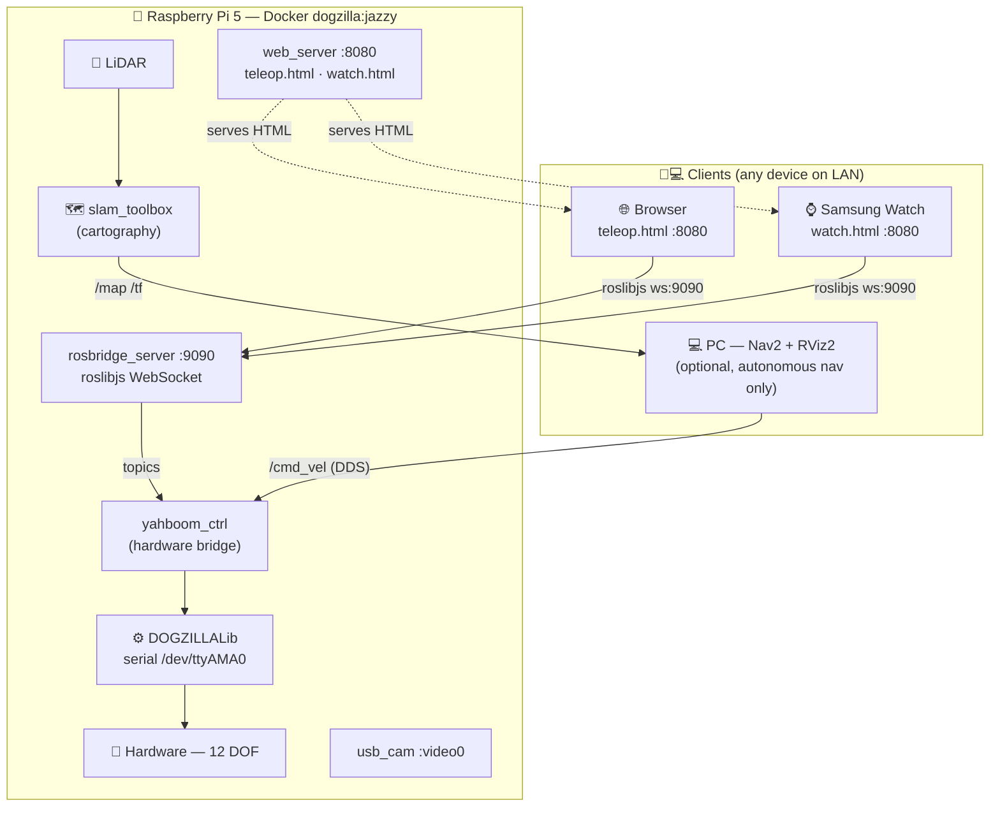

<div align="center">

# 🐕 DOGZILLA

**Autonomous 12-DOF Quadruped Robot — ROS 2 · Raspberry Pi 5 · Docker**

<p>
  
  
  
  
</p>

*Browser-based teleop · SLAM mapping · Autonomous navigation · Digital twin in RViz2*

</div>

---

## Architecture



> **Key design principle — teleop lives on the Pi.**  
> The browser (phone, tablet, PC, watch) is just a UI skin — it connects to `rosbridge` on the Pi and publishes standard ROS 2 topics.  
> The PC is **optional**: only needed for Nav2 autonomous navigation or RViz2 digital-twin inspection.  
> Swapping `yahboom_ctrl` for a Gazebo bridge gives a full simulation with zero client-side changes.

---

## Teleop Interface

A dark-themed single-page app served directly from the Pi at `http://<pi-ip>:8080/teleop.html`.  
A compact watch page is at `http://<pi-ip>:8080/watch.html` (optimised for Samsung Internet, 360×360 px).

The interface adapts to the device automatically:

| Breakpoint | Layout |
|---|---|
| PC / large tablet (> 1050 px) | 3-column grid: D-pad · Camera+Posture · Actions |
| Tablet (601–1050 px) | Same grid, smaller cells |
| Mobile (≤ 600 px) | Tab bar — Drive (joystick + mini cam) / Posture / Actions |

**Controls:**

| Zone | Controls |
|---|---|
| **D-pad** | `Z`/↑ fwd · `S`/↓ back · `Q`/← left · `D`/→ right · `A` turn-L · `E` turn-R · `Space` stop |
| **Pace** | `F1` slow · `F2` normal · `F3` high (or click buttons) |
| **Actions** | `1`–`9` keys or click — 19 motions (Stand Up, Crawl, Wave, Handshake …) |
| **Reset** | `0` — restores initial posture |
| **Sliders** | Translation X/Y/Z (mm) · Attitude Roll/Pitch/Yaw (°) |
| **Camera** | Live MJPEG from `http://<pi-ip>:6500/video_feed` (auto-detected from rosbridge URL) |

The rosbridge URL is auto-detected from the page hostname; the status dot in the header shows connection state.

---

## Quick Start

### 1 — Build & transfer the Docker image to the Pi

> Build happens on the PC (x86 → ARM64 cross-compilation via QEMU + buildx).  
> The Pi image contains: hardware bridge · sensors · SLAM · **rosbridge + teleop web server**.  
> Nav2 runs on the PC separately.

```bash
# One-time setup
sudo apt install docker-buildx
docker buildx create --name multiarch --use
docker buildx inspect --bootstrap

# Build ARM64 image (~30 min first time)
cd ~/dogzilla
docker buildx build \
  --platform linux/arm64 \
  -f docker/Dockerfile.jazzy \
  -t dogzilla:jazzy \
  --output type=docker,dest=/tmp/dogzilla_jazzy_arm64.tar \
  .

# Transfer to Pi
scp /tmp/dogzilla_jazzy_arm64.tar pi@<pi-ip>:~
ssh pi@<pi-ip> sudo docker load -i dogzilla_jazzy_arm64.tar
```

### 2 — Launch the robot

Three usage modes are available. Pick based on your use case.

---

#### Mode A — Smartphone direct (no ROS 2, no Docker)

The simplest mode — the Pi controls hardware directly via the Yahboom app.

**Pi**
```bash
cd ~/app_dogzilla
python3 app_dogzilla.py
```

Open the Yahboom mobile app and connect to `<pi-ip>:6000`.

> Do **not** run Docker / `yahboom_ctrl` at the same time — both need `/dev/ttyAMA0`.

---

#### Mode B — Browser / Watch teleop (ROS 2, Pi-only)

The teleop web server and rosbridge run **on the Pi**. No PC required — any browser on the LAN controls the robot.

**Pi**
```bash
./docker/run_jazzy.sh
# The container automatically starts:
#   yahboom_ctrl · rosbridge :9090 · web_server :8080
```

**Any client** (PC, phone, tablet, watch):
```
http://<pi-ip>:8080/teleop.html   ← full interface
http://<pi-ip>:8080/watch.html    ← Samsung Watch / compact
```

The page auto-connects to `ws://<pi-ip>:9090`. The status dot turns green when connected.

---

#### Mode C — Smartphone + ROS 2 bridge

Yahboom mobile app commands flow through ROS 2 topics, enabling Nav2 or other nodes on the same stack.

**Pi — two terminals**
```bash
# Terminal 1 — Docker: hardware bridge + teleop
./docker/run_jazzy.sh

# Terminal 2 — bare metal: smartphone TCP bridge
cd ~/app_dogzilla
python3 app_dogzilla_ros2.py
```

Open the Yahboom mobile app and connect to `<pi-ip>:6000`.

> `app_dogzilla_ros2.py` publishes ROS 2 topics; it does **not** open the serial port.  
> `yahboom_ctrl` (inside Docker) consumes those topics. The two processes coexist safely.

---

#### Mode D — Autonomous navigation (Nav2 on PC)

Nav2 runs on the PC (more compute); the Pi runs robot + sensors only.

**Pi**
```bash
./docker/run_jazzy.sh nav /root/maps/map.yaml
```

**PC — install Nav2 once, then launch**
```bash
sudo apt install ros-jazzy-navigation2 ros-jazzy-nav2-bringup

export ROS_DOMAIN_ID=0
export FASTRTPS_DEFAULT_PROFILES_FILE=~/dogzilla/fastdds_unicast.xml

ros2 launch dogzilla_nav navigation.launch.py map:=/path/to/map.yaml
```

Set a **2D Nav Goal** in RViz2 — Nav2 plans the path and sends `/cmd_vel` to the Pi.

---

## SLAM Mapping

```bash
# Pi — start SLAM
./docker/run_jazzy.sh slam

# PC — visualise in RViz2 (optional)
export ROS_DOMAIN_ID=0
export FASTRTPS_DEFAULT_PROFILES_FILE=~/dogzilla/fastdds_unicast.xml
rviz2   # add: Map · LaserScan · RobotModel · TF
```

Drive the robot with the teleop interface while the map builds in RViz2.

**Record a bag for offline SLAM tuning:**
```bash
ros2 bag record /scan /odom /tf /tf_static -o slam_session
ros2 bag play slam_session
```

---

## PC ↔ Pi Networking

Both machines must share `ROS_DOMAIN_ID=0` on the same LAN.

```bash
export ROS_DOMAIN_ID=0
export FASTRTPS_DEFAULT_PROFILES_FILE=~/dogzilla/fastdds_unicast.xml
```

`fastdds_unicast.xml` disables multicast (required on most Wi-Fi networks).  
Edit `<address>` inside to set the Pi's static IP if needed.

---

## ROS 2 Node Reference

### Pi Docker container (`dogzilla:jazzy`) — always running

| Node | Package | Role |
|---|---|---|
| `yahboom_ctrl` | `yahboom_base` | **Hardware bridge** — subscribes `/cmd_vel` + `/dogzilla/*` topics, calls DOGZILLALib, sends serial frames to `/dev/ttyAMA0` |
| `robot_state_publisher` | `robot_state_publisher` | Reads URDF, publishes `/tf_static` skeleton (links and joints) |
| `yahboomcar_joint_state` | `yahboom_dog_joint_state` | Reads servo angles and onboard IMU from the robot, publishes `/joint_states` and `/imu/data_raw_self` |
| `usb_cam_node_exe` | `usb_cam` | Opens `/dev/video0`, publishes `/image_raw` (+ `/image_raw/compressed`) |
| `rosbridge_websocket` | `rosbridge_server` | WebSocket server `:9090` — translates roslibjs JSON ↔ ROS 2 DDS topics in real time |
| `dogzilla_web_server` | `dogzilla_teleop` | HTTP server `:8080` — serves `teleop.html`, `watch.html`, `manifest.json`; no ROS logic |

### Pi Docker container — SLAM mode only

| Node | Package | Role |
|---|---|---|
| `slam_toolbox` | `slam_toolbox` | Online SLAM — fuses `/scan` + `/odom` + `/tf` to build and publish `/map` |
| LiDAR driver | `oradar_lidar` or `ydlidar_ros2_driver` | Reads LiDAR hardware, publishes `/scan` |

### PC (optional — Nav2 / digital twin)

| Node | Package | Role |
|---|---|---|
| `nav2_bringup` | `nav2_bringup` | Full Nav2 stack — global planner, local planner, costmap; consumes `/map` from Pi, sends `/cmd_vel` |
| `slam_toolbox` (localisation) | `slam_toolbox` | Loads a saved map and localises the robot in it (no new mapping) |
| `rviz2` | `rviz2` | 3D visualisation — robot model, TF, laser, map, costmap, paths |

### Perception nodes (optional, launch individually)

| Node | Package | Role |
|---|---|---|
| `yahboom_color_tracking` | `yahboom_color_tracking` | Tracks a colored object in the camera frame, publishes `/cmd_vel` to follow it |
| `yahboom_qrcode_tracking` | `yahboom_qrcode_tracking` | Detects a QR code and follows it |
| `yahboom_mediapipe` | `yahboom_mediapipe` | Hand/pose/face landmark detection via MediaPipe, publishes `/mediapipe/points` |
| `yahboom_publish` (C++) | `yahboom_publish` | Camera driver + image pipeline: publishes `/image_raw/compressed`, `/image_contours`, `/obj_msg` |
| `yahboom_color_identify_server` | `yahboom_color_identify_server` | Service server `yahboomColorIdentify` — identifies dominant LAB color in a frame |
| Laser tracker / avoider / warning | `yahboom_laser` | LiDAR-based obstacle avoidance, object following, proximity buzzer |

---

## ROS 2 Topics & Services

### Motion Control

| Topic | Type | Publisher | Subscriber | Notes |
|---|---|---|---|---|
| `/cmd_vel` | `geometry_msgs/Twist` | Teleop UI · Nav2 · laser nodes · color/QR trackers | `yahboom_ctrl` | main locomotion command |
| `/dogzilla/action` | `std_msgs/Int32` | Teleop UI (rosbridge) | `yahboom_ctrl` | 1–19 motions · 255=reset |
| `/dogzilla/pace` | `std_msgs/String` | Teleop UI (rosbridge) | `yahboom_ctrl` | `slow` / `normal` / `high` |
| `/dogzilla/translation` | `geometry_msgs/Vector3` | Teleop UI (rosbridge) | `yahboom_ctrl` | x±35mm y±18mm z75-115mm |
| `/dogzilla/attitude` | `geometry_msgs/Vector3` | Teleop UI (rosbridge) | `yahboom_ctrl` | roll±20° pitch±15° yaw±11° |
| `/JoyState` | `std_msgs/Bool` | joystick node | laser tracker / avoidance / warning | enables autonomous laser modes |
| `/Buzzer` | `std_msgs/Bool` | laser warning nodes | hardware | proximity alarm |

### Sensors & State

| Topic | Type | Publisher | Subscriber | Notes |
|---|---|---|---|---|
| `/scan` | `sensor_msgs/LaserScan` | oradar/ydlidar driver | slam_toolbox · laser nodes | main mapping input |
| `/joint_states` | `sensor_msgs/JointState` | `yahboomcar_joint_state` | robot_state_publisher | 12 DOF · lf/lh/rf/rh hip · upper/lower leg |
| `/imu/data_raw_self` | `sensor_msgs/Imu` | `yahboomcar_joint_state` | Nav2 (PC) | orientation as quaternion from roll/pitch/yaw |
| `/battery_voltage` | `std_msgs/Float32` | `yahboom_ctrl` | Teleop UI (via rosbridge) | displayed in browser header |
| `/map` | `nav_msgs/OccupancyGrid` | slam_toolbox (Pi) | Nav2 · RViz2 (PC) | built during SLAM phase |
| `/tf` · `/tf_static` | — | `tf_publisher` · robot_state_publisher | RViz2 · Nav2 | `base_footprint → base_link` (x:0.115m z:0.047m) |

### Perception

| Topic | Type | Publisher | Subscriber | Notes |
|---|---|---|---|---|
| `/image_raw/compressed` | `sensor_msgs/CompressedImage` | `yahboom_publish` (C++ node) | qrcode tracker | raw camera MJPEG |
| `/image_contours` | `sensor_msgs/CompressedImage` | `yahboom_publish` | `yahboom_color_tracking` | contours drawn over frame |
| `/obj_msg` | `image_color_lab/StringStamped` | `yahboom_publish` | color tracker · QR tracker | JSON: area, center_x/y, img_w/h, movement |
| `/lab_set` | `std_msgs/String` | external / UI | `yahboom_publish` | LAB color range params for segmentation |
| `/mediapipe/points` | `yahboom_msgs/PointArray` | HandDetector · PoseDetector · Holistic · FaceMesh | any consumer | MediaPipe landmarks (hand/pose/face) |

### Services

| Service | Type | Server | Client | Notes |
|---|---|---|---|---|
| `yahboomSetAttiude` | `yahboom_attitude_record_interfaces/AttuitudeRecord` | attitude record node | `yahboom_color_tracking` | set pitch/yaw during tracking · req: pitch+yaw int64 · res: string |
| `yahboomColorIdentify` | `yahboom_color_identify_interfaces/ColorIdentify` | `yahboom_color_identify_server` | color tracking nodes | identify dominant color in frame · req: if_identify string |

---

## Pi Startup Programs

Two programs can run on the Pi as the startup entry point. They share the same Flask HTTP server (:6500), TCP smartphone socket (:6000), camera stream, joystick and OLED threads. The only difference is **how hardware commands reach the robot**.

Only one can run at a time — both need exclusive access to the serial port (direct mode) or to `yahboom_ctrl` (ROS 2 mode).

---

### `app_dogzilla.py` — direct mode

```
Smartphone / Yahboom App
      │  TCP :6000  /  HTTP :6500
      ▼
app_dogzilla.py
      │  DOGZILLALib
      ▼
/dev/ttyAMA0  →  hardware
```

`DOGZILLA()` is instantiated at module level and used directly throughout. Every TCP command translates immediately to a serial frame — no ROS 2 involved.

**Threads started at launch:**

| Thread | Role |
|---|---|
| `task_press_up` | Push-up animation loop (action 20) |
| `task_joystick` | USB joystick → DOGZILLALib |
| `task_oled` | OLED display (if systemd unit not active) |
| `task_tcp` (daemon) | TCP server :6000 — spawned on first `/init` call |
| Gevent WSGIServer | Flask HTTP :6500 — main thread |

**TCP protocol (ASCII frames `$<TYPE><CMD><LEN><DATA><CHK>#`):**

| Command | What it does |
|---|---|
| `0F` | Switch mode (Home / Standard / Fullscreen / Motor / Leg) |
| `02` | Request battery voltage |
| `11` | Joystick move — nx/ny → `move_x` / `move_y` |
| `12` | D-pad button — forward / back / left / right / turn L / turn R / stop |
| `13` | Step scale (20–100) |
| `14` | Pace frequency — 1=slow (Z→75mm) · 2=normal · 3=high |
| `15` | IMU stabilisation on/off |
| `21` | Attitude — joystick tilt → roll/pitch |
| `22` | Body height Z (75–110 mm) |
| `23` | Shoulder yaw (±11°) |
| `31` | Action 1–19 · 0=reset · 20=push-up animation |
| `32` | Continuous performance (carousel) on/off |
| `33` | Leg reset / full reset |
| `41` | Individual servo — forwarded to `motor()` |
| `51` | Individual leg — forwarded to `leg()` |
| `AA` | Calibration mode |

Startup sequence: `motor_speed(50)` → `action(14)` (Stretch animation).

---

### `app_dogzilla_ros2.py` — ROS 2 bridge mode

```
Smartphone / Yahboom App
      │  TCP :6000  /  HTTP :6500
      ▼
app_dogzilla_ros2.py
      │  ROS 2 topics
      ▼
yahboom_ctrl  (running inside Docker)
      │  DOGZILLALib
      ▼
/dev/ttyAMA0  →  hardware
```

`DOGZILLA()` is replaced by `DogzillaROS2(Node)` — same Python API, but every call publishes a ROS 2 topic instead of writing to serial.

**`DogzillaROS2` — published topics:**

| Method called | Topic published | Type |
|---|---|---|
| `stop()` / `move_x/y()` / `forward()` … | `/cmd_vel` | `geometry_msgs/Twist` |
| `action(id)` | `/dogzilla/action` | `std_msgs/Int32` |
| `pace(mode)` | `/dogzilla/pace` | `std_msgs/String` |
| `translation(axis, val)` | `/dogzilla/translation` | `geometry_msgs/Vector3` |
| `attitude(axis, val)` | `/dogzilla/attitude` | `geometry_msgs/Vector3` |
| `imu(state)` | `/dogzilla/imu` | `std_msgs/Bool` |
| `perform(mode)` | `/dogzilla/perform` | `std_msgs/Int32` |

`translation` and `attitude` keep local state so that a single-axis update still publishes the full Vector3. Battery is received from `/battery_voltage` (published by `yahboom_ctrl`).

**Commands silently disabled in ROS 2 mode:**

| Command | Reason |
|---|---|
| `41` (individual servo) | No topic equivalent |
| `51` (individual leg) | No topic equivalent |
| `AA` (calibration) | Safety: calibration must go through the serial bridge |

**rclpy thread model:** `rclpy.init()` and `rclpy.spin()` run in a daemon thread; Flask/Gevent holds the main thread. Shutdown calls `rclpy.shutdown()` on `KeyboardInterrupt`.

---

### Switching between modes

```bash
# Direct mode (no ROS 2 needed)
ln -sf /path/to/app_dogzilla.py      ~/autostart/app.py

# ROS 2 bridge mode (yahboom_ctrl must be running)
ln -sf /path/to/app_dogzilla_ros2.py ~/autostart/app.py
```

> **Do not run both simultaneously.** `app_dogzilla.py` opens `/dev/ttyAMA0` directly; `yahboom_ctrl` (needed by `app_dogzilla_ros2.py`) also opens that port. Running both at the same time will cause serial port conflicts.

---

## Repository Layout

```
dogzilla/
├── DOGZILLALib/              hardware library — serial framing to /dev/ttyAMA0
├── app_dogzilla/             legacy Flask app (port 6500) — direct or ROS 2 bridge mode
├── docker/
│   ├── Dockerfile.jazzy      Pi image: ROS Jazzy + slam-toolbox + rosbridge + teleop
│   ├── entrypoint.sh         default start: yahboom_ctrl + sensors + rosbridge + web_server
│   ├── entrypoint_slam.sh    SLAM mode: adds slam_toolbox + lidar driver
│   └── run_jazzy.sh          launcher — modes: robot (default) / slam / nav
├── samples/                  Jupyter notebooks (control, vision, LLM)
├── yahboomcar_ws/src/
│   ├── dogzilla_teleop/      web teleop — serves teleop.html + watch.html on Pi :8080
│   ├── yahboom_base/         hardware bridge — yahboom_ctrl node
│   ├── yahboom_bringup/      SLAM + Nav2 launch files
│   ├── yahboom_description/  URDF model
│   └── …                     20+ additional ROS 2 packages (perception, laser, mediapipe…)
├── fastdds_unicast.xml       DDS peer discovery for local LAN (disables multicast)
└── CLAUDE.md                 AI coding assistant guide
```

---

<div align="center">
<sub>Built with ROS 2 Jazzy · Yahboom Dogzilla S2 · Raspberry Pi 5</sub>
</div>
