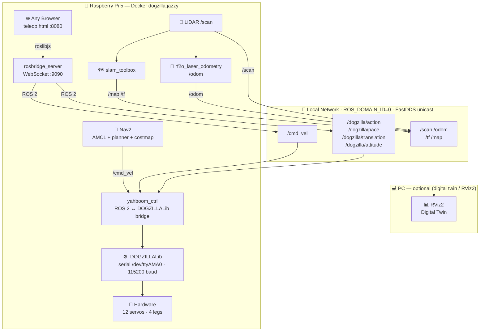

<div align="center">

# 🐕 DOGZILLA

**Autonomous 12-DOF Quadruped Robot — ROS 2 · Raspberry Pi 5 · Docker**

<p>
  
  
  
  
</p>

*Browser-based teleop · SLAM mapping · Autonomous navigation · Digital twin in RViz2*

</div>

---

## Architecture



Everything runs on the Pi — the browser is the only client needed.  
`roslibjs` talks directly to `rosbridge` over WebSocket. Nav2 runs in the same Docker container.  
The PC is optional, only needed for RViz2 visualization.

---

## Teleop Interface

A dark-themed single-page app served at `http://<pi-ip>:8080/teleop.html`:

| Zone | Controls |
|---|---|
| **D-pad** | `Z`/↑ fwd · `S`/↓ back · `Q`/← left · `D`/→ right · `A` turn-L · `E` turn-R · `Space` stop |
| **Pace** | `F1` slow · `F2` normal · `F3` high (or click buttons) |
| **Actions** | `1`–`9` keys or click — 19 motions (Stand Up, Crawl, Wave, Handshake …) |
| **Reset** | `0` — restores initial posture |
| **Camera** | live feed via `/image_raw/compressed` (rosbridge) |
| **Sliders** | Translation X/Y/Z (mm) · Attitude Roll/Pitch/Yaw (°) |

The interface adapts to PC (3-column layout), smartphone, and Samsung Watch.

---

## Quick Start

### 1 — First-time setup on the Pi

```bash
git clone <repo> ~/dogzilla

# Build the ROS 2 workspace inside the container (results persist via volume mount)
./docker/run_jazzy.sh --build
```

The `--build` step runs `colcon build` natively on the Pi (ARM64) and persists
`install/`, `build/`, and `log/` directories in `yahboomcar_ws/` on the host.
Only needed once, or after modifying ROS 2 packages.

### 2 — Build & transfer the Docker image

> Build happens on the PC (x86 → ARM64 cross-compilation via QEMU + buildx).
> Run once; re-run only when `Dockerfile.jazzy` or base dependencies change.

```bash
# One-time setup
sudo apt install docker-buildx
docker buildx create --name multiarch --use
docker buildx inspect --bootstrap

# Build ARM64 image (~30 min first time)
cd ~/dogzilla
docker buildx build \
  --platform linux/arm64 \
  -f docker/Dockerfile.jazzy \
  -t dogzilla:jazzy \
  --output type=docker,dest=/tmp/dogzilla_jazzy_arm64.tar \
  .

# Transfer to Pi
scp /tmp/dogzilla_jazzy_arm64.tar pi@<pi-ip>:~
ssh pi@<pi-ip> docker load -i dogzilla_jazzy_arm64.tar
```

### 3 — Launch

**Robot mode (teleop)**
```bash
./docker/run_jazzy.sh --robot
# open http://<pi-ip>:8080/teleop.html in any browser
```

**SLAM — build a map**
```bash
./docker/run_jazzy.sh --slam
# drive the robot while the map builds
# save with: ros2 run nav2_map_server map_saver_cli -f ~/maps/my_map
```

**Navigation — autonomous (Nav2 on Pi)**
```bash
./docker/run_jazzy.sh --nav /root/maps/my_map.yaml
# set a 2D Nav Goal in RViz2 — robot navigates on its own
```

---

## SLAM Mapping

```bash
# Pi
./docker/run_jazzy.sh --slam

# PC — visualise in RViz2 (optional)
export ROS_DOMAIN_ID=0
export FASTRTPS_DEFAULT_PROFILES_FILE=~/dogzilla/fastdds_unicast.xml
rviz2   # add: Map · LaserScan · RobotModel · TF
```

Drive the robot with the teleop browser while the map builds.

**Record a bag for offline SLAM tuning:**
```bash
ros2 bag record /scan /odom /tf /tf_static -o slam_session
ros2 bag play slam_session   # replay as many times as needed
```

---

## Autonomous Navigation (Nav2 on Pi)

Nav2 runs entirely inside the Docker container on the Pi.
It takes a saved map, localises the robot with AMCL, and publishes `/cmd_vel`
to `yahboom_ctrl` — exactly like the teleop browser.

Odometry is computed by `rf2o_laser_odometry` from consecutive LiDAR scans
(no wheel encoders on this robot).

```bash
# Pi — load a saved map and start Nav2
./docker/run_jazzy.sh --nav /root/maps/my_map.yaml
```

```
Browser (teleop override)        RViz2 (PC, optional)
         │                              │
         └──────── rosbridge ───────────┘
                        │
                    Nav2 (Pi)
                        │  /cmd_vel
                   yahboom_ctrl (Pi) → hardware
```

Set a **2D Nav Goal** in RViz2 and the robot walks there on its own.  
The teleop browser remains available for manual override at any time.

Nav2 params: `yahboomcar_ws/src/yahboom_bringup/config/nav2_params.yaml`

---

## PC ↔ Pi Networking

Both machines must share `ROS_DOMAIN_ID=0` on the same LAN.

```bash
export ROS_DOMAIN_ID=0
export FASTRTPS_DEFAULT_PROFILES_FILE=~/dogzilla/fastdds_unicast.xml
```

`fastdds_unicast.xml` disables multicast (required on most Wi-Fi networks).  
Edit `<address>` inside to set the Pi's static IP if needed.

---

## ROS 2 Node Reference

### Pi — Docker container (always active in --robot and --nav)

| Node | Package | Role |
|---|---|---|
| `yahboom_ctrl` | `yahboom_base` | `/cmd_vel` + `/dogzilla/*` → DOGZILLALib → serial `/dev/ttyAMA0` |
| `robot_state_publisher` | `robot_state_publisher` | URDF → `/tf_static` |
| `yahboomcar_joint_state` | `yahboom_dog_joint_state` | Servo angles + IMU → `/joint_states` + `/imu/data_raw_self` |
| `usb_cam_node_exe` | `usb_cam` | `/dev/video0` → `/image_raw` |
| `rosbridge_websocket` | `rosbridge_server` | WebSocket `:9090` — roslibjs ↔ ROS 2 topics |
| `web_server` | `dogzilla_teleop` | HTTP `:8080` — serves `teleop.html` |

### Pi — SLAM mode only (`--slam`)

| Node | Package | Role |
|---|---|---|
| LiDAR driver | `oradar_lidar` | `/dev/ttyAMA1` → `/scan` |
| `slam_toolbox` | `slam_toolbox` | `/scan` + `/tf` → builds and publishes `/map` |

### Pi — Nav mode only (`--nav`)

All robot mode nodes, plus:

| Node | Package | Role |
|---|---|---|
| LiDAR driver | `oradar_lidar` | `/dev/ttyAMA1` → `/scan` |
| `rf2o_laser_odometry` | `rf2o_laser_odometry` | consecutive scans → `/odom` (no wheel encoders) |
| `nav2_bringup` stack | `nav2_bringup` | map server + AMCL + planner + controller + costmaps |

### PC — optional

| Component | Role |
|---|---|
| `rviz2` | Digital twin — RobotModel, TF, LaserScan, Map, costmap, trajectories |

### Perception nodes (optional, launch manually)

| Node | Package | Role |
|---|---|---|
| `yahboom_color_tracking` | `yahboom_color_tracking` | Tracks a colored object → `/cmd_vel` |
| `yahboom_qrcode_tracking` | `yahboom_qrcode_tracking` | Detects and tracks QR codes |
| `yahboom_mediapipe` | `yahboom_mediapipe` | Hand/pose landmarks → `/mediapipe/points` |
| Laser tracker / avoider | `yahboom_laser` | LiDAR-based obstacle avoidance and object following |

---

## ROS 2 Topics Reference

| Topic | Type | Flow |
|---|---|---|
| `/cmd_vel` | `geometry_msgs/Twist` | Teleop · Nav2 → `yahboom_ctrl` |
| `/dogzilla/action` | `std_msgs/Int32` | Browser → `yahboom_ctrl` · 1–19 · 255=reset |
| `/dogzilla/pace` | `std_msgs/String` | Browser → `yahboom_ctrl` · `slow`/`normal`/`high` |
| `/dogzilla/translation` | `geometry_msgs/Vector3` | Browser → `yahboom_ctrl` · x±35 y±18 z75-115 mm |
| `/dogzilla/attitude` | `geometry_msgs/Vector3` | Browser → `yahboom_ctrl` · roll±20° pitch±15° yaw±11° |
| `/battery_voltage` | `std_msgs/Float32` | `yahboom_ctrl` → browser header |
| `/image_raw` | `sensor_msgs/Image` | `usb_cam` → pipeline |
| `/image_raw/compressed` | `sensor_msgs/CompressedImage` | `usb_cam` → teleop browser (via rosbridge) |
| `/joint_states` | `sensor_msgs/JointState` | `yahboomcar_joint_state` → `robot_state_publisher` |
| `/imu/data_raw_self` | `sensor_msgs/Imu` | `yahboomcar_joint_state` → Nav2 |
| `/scan` | `sensor_msgs/LaserScan` | LiDAR driver → `slam_toolbox` · `rf2o` · Nav2 |
| `/odom` | `nav_msgs/Odometry` | `rf2o_laser_odometry` → Nav2 |
| `/map` | `nav_msgs/OccupancyGrid` | `slam_toolbox` / Nav2 map server → RViz2 |
| `/tf`, `/tf_static` | — | `robot_state_publisher` → RViz2 · Nav2 |

---

## Repository Layout

```
dogzilla/
├── DOGZILLALib/              hardware library — serial framing to /dev/ttyAMA0
├── app_dogzilla/             legacy Flask app (port 6500)
├── docker/
│   ├── Dockerfile.jazzy      ROS Jazzy + slam-toolbox + nav2 + rf2o (ARM64)
│   ├── entrypoint.sh         --robot: yahboom_ctrl + sensors + rosbridge + web
│   ├── entrypoint_slam.sh    --slam: + LiDAR driver + slam_toolbox
│   ├── entrypoint_nav.sh     --nav: + LiDAR + rf2o + full Nav2 stack
│   ├── entrypoint_build.sh   --build: colcon build (results persist via volume)
│   └── run_jazzy.sh          launcher — modes: --robot / --slam / --nav / --build
├── samples/                  Jupyter notebooks (control, vision, LLM)
├── yahboomcar_ws/src/
│   ├── dogzilla_teleop/      web teleop UI (served from Pi)
│   ├── yahboom_base/         hardware bridge — yahboom_ctrl node
│   ├── yahboom_bringup/      SLAM + Nav2 launch files + nav2_params.yaml
│   ├── yahboom_description/  URDF model
│   └── …                     20+ additional ROS 2 packages
├── fastdds_unicast.xml       DDS peer discovery for local network
└── CLAUDE.md                 AI coding assistant guide
```

---

<div align="center">
<sub>Built with ROS 2 Jazzy · Yahboom Dogzilla S2 · Raspberry Pi 5</sub>
</div>
