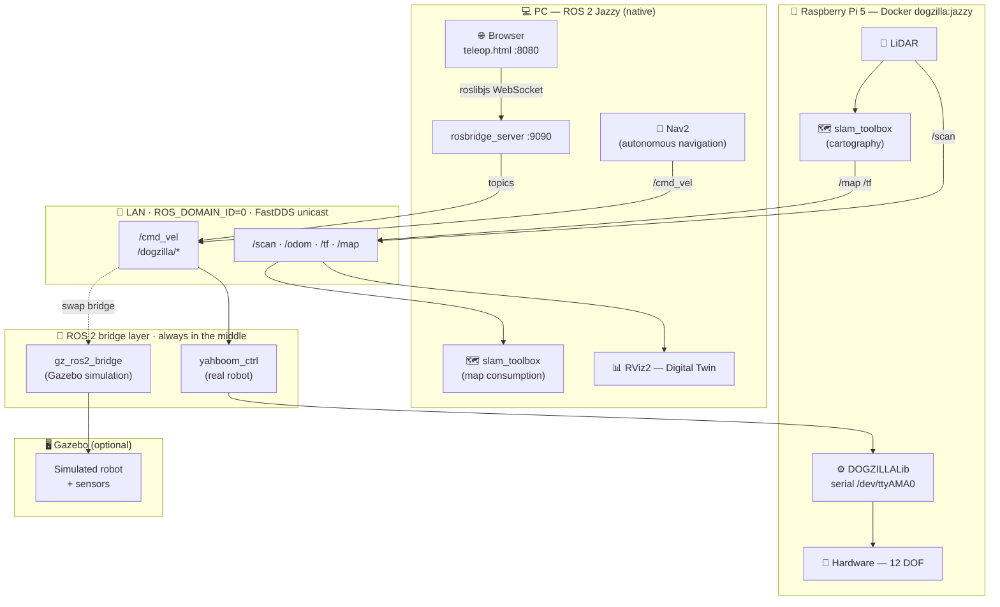

<div align="center">

# 🐕 DOGZILLA

**Autonomous 12-DOF Quadruped Robot — ROS 2 · Raspberry Pi 5 · Docker**

<p>
  
  
  
  
</p>

*Browser-based teleop · SLAM mapping · Autonomous navigation · Digital twin in RViz2*

</div>

---

## Architecture



> **Key design principle** — the bridge layer is always between the PC and the hardware.  
> Teleop, Nav2 and any autonomous behaviour publish **only ROS 2 topics**.  
> Swapping `yahboom_ctrl` for `gz_ros2_bridge` gives a full Gazebo simulation with zero PC-side changes.

---

## Teleop Interface

<div align="center">


</div>

A dark-themed single-page app served at `http://localhost:8080/teleop.html`:

| Zone | Controls |
|---|---|
| **D-pad** | `Z`/↑ fwd · `S`/↓ back · `Q`/← left · `D`/→ right · `A` turn-L · `E` turn-R · `Space` stop |
| **Pace** | `F1` slow · `F2` normal · `F3` high (or click buttons) |
| **Actions** | `1`–`9` keys or click — 19 motions (Stand Up, Crawl, Wave, Handshake …) |
| **Reset** | `0` — restores initial posture |
| **Sliders** | Translation X/Y/Z (mm) · Attitude Roll/Pitch/Yaw (°) |

Connection URL is editable in the header — switch from `ws://localhost:9090` to `ws://<pi-ip>:9090` to drive the real robot.

---

## Quick Start

### 1 — PC setup

```bash
# ROS 2 Jazzy + rosbridge
sudo apt install ros-jazzy-desktop ros-jazzy-rosbridge-server

# Build the teleop package
cd ~/dogzilla/yahboomcar_ws
colcon build --packages-select dogzilla_teleop
source install/setup.bash
```

### 2 — Build & transfer the Docker image to the Pi

> Build happens on the PC (x86 → ARM64 cross-compilation via QEMU + buildx).  
> The Pi image contains only: hardware bridge, sensors, slam-toolbox. **Nav2 is on the PC.**

```bash
# One-time setup
sudo apt install docker-buildx
docker buildx create --name multiarch --use
docker buildx inspect --bootstrap

# Build ARM64 image (~30 min first time)
cd ~/dogzilla
docker buildx build \
  --platform linux/arm64 \
  -f docker/Dockerfile.jazzy \
  -t dogzilla:jazzy \
  --output type=docker,dest=/tmp/dogzilla_jazzy_arm64.tar \
  .

# Transfer to Pi
scp /tmp/dogzilla_jazzy_arm64.tar pi@<pi-ip>:~
ssh pi@<pi-ip> docker load -i dogzilla_jazzy.tar
```

### 3 — Launch teleop

**PC**
```bash
source /opt/ros/jazzy/setup.bash
source ~/dogzilla/yahboomcar_ws/install/setup.bash

ros2 launch dogzilla_teleop teleop.launch.py
# → opens http://localhost:8080/teleop.html automatically
```

**Pi** (inside Docker container)
```bash
./docker/run_jazzy.sh

# inside the container:
ros2 launch yahboom_base yahboom_base.launch.py
```

Change the rosbridge URL in the browser to `ws://<pi-ip>:9090` and the dot turns green.

---

## SLAM Mapping

```bash
# Pi — start SLAM
./docker/run_jazzy.sh slam

# PC — visualise in RViz2
export ROS_DOMAIN_ID=0
export FASTRTPS_DEFAULT_PROFILES_FILE=~/dogzilla/fastdds_unicast.xml
rviz2   # add: Map · LaserScan · RobotModel · TF
```

Drive the robot with the teleop interface while the map builds in RViz2.

**Record a bag for offline SLAM tuning:**
```bash
ros2 bag record /scan /odom /tf /tf_static -o slam_session
ros2 bag play slam_session   # replay as many times as needed
```

---

## Autonomous Navigation

Nav2 runs on the **PC** (more compute, keeps the Pi lean).  
`yahboom_ctrl` on the Pi simply consumes `/cmd_vel` — same as teleop.

```bash
# PC — install Nav2 (once)
sudo apt install ros-jazzy-navigation2 ros-jazzy-nav2-bringup

# Pi — robot mode only (no Nav2 in Docker image)
./docker/run_jazzy.sh

# PC — launch Nav2 with a saved map
ros2 launch dogzilla_nav navigation.launch.py map:=/path/to/map.yaml
```

Set a **2D Nav Goal** in RViz2 — Nav2 plans the path and sends `/cmd_vel` to the Pi.  
Set a 2D Nav Goal in RViz2 and the robot walks there on its own.

---

## PC ↔ Pi Networking

Both machines must share `ROS_DOMAIN_ID=0` on the same LAN.

```bash
export ROS_DOMAIN_ID=0
export FASTRTPS_DEFAULT_PROFILES_FILE=~/dogzilla/fastdds_unicast.xml
```

`fastdds_unicast.xml` disables multicast (required on most Wi-Fi networks).  
Edit `<address>` inside to set the Pi's static IP if needed.

---

## ROS 2 Topics Reference

| Topic | Type | Flow |
|---|---|---|
| `/cmd_vel` | `geometry_msgs/Twist` | PC → Pi |
| `/dogzilla/action` | `std_msgs/Int32` | PC → Pi · 1–19 · 255=reset |
| `/dogzilla/pace` | `std_msgs/String` | PC → Pi · `slow`/`normal`/`high` |
| `/dogzilla/translation` | `geometry_msgs/Vector3` | PC → Pi · x±35 y±18 z75-115 mm |
| `/dogzilla/attitude` | `geometry_msgs/Vector3` | PC → Pi · roll±20° pitch±15° yaw±11° |
| `/scan` | `sensor_msgs/LaserScan` | Pi → PC |
| `/odom` | `nav_msgs/Odometry` | Pi → PC |
| `/tf`, `/tf_static` | — | Pi → PC |
| `/map` | `nav_msgs/OccupancyGrid` | Pi → PC (SLAM / Nav mode) |

---

## Repository Layout

```
dogzilla/
├── DOGZILLALib/              hardware library — serial framing to /dev/ttyAMA0
├── app_dogzilla/             legacy Flask app (port 6500)
├── docker/
│   ├── Dockerfile.jazzy      ROS Jazzy + slam-toolbox + nav2 (ARM64)
│   └── run_jazzy.sh          container launcher — modes: robot / slam / nav
├── samples/                  Jupyter notebooks (control, vision, LLM)
├── yahboomcar_ws/src/
│   ├── dogzilla_teleop/      web teleop interface (PC only)
│   ├── yahboom_base/         hardware bridge — yahboom_ctrl node (Pi)
│   ├── yahboom_bringup/      SLAM + Nav2 launch files
│   ├── yahboom_description/  URDF model
│   └── …                     20+ additional ROS 2 packages
├── fastdds_unicast.xml       DDS peer discovery for local network
└── CLAUDE.md                 AI coding assistant guide
```

---

<div align="center">
<sub>Built with ROS 2 Jazzy · Yahboom Dogzilla S2 · Raspberry Pi 5</sub>
</div>
