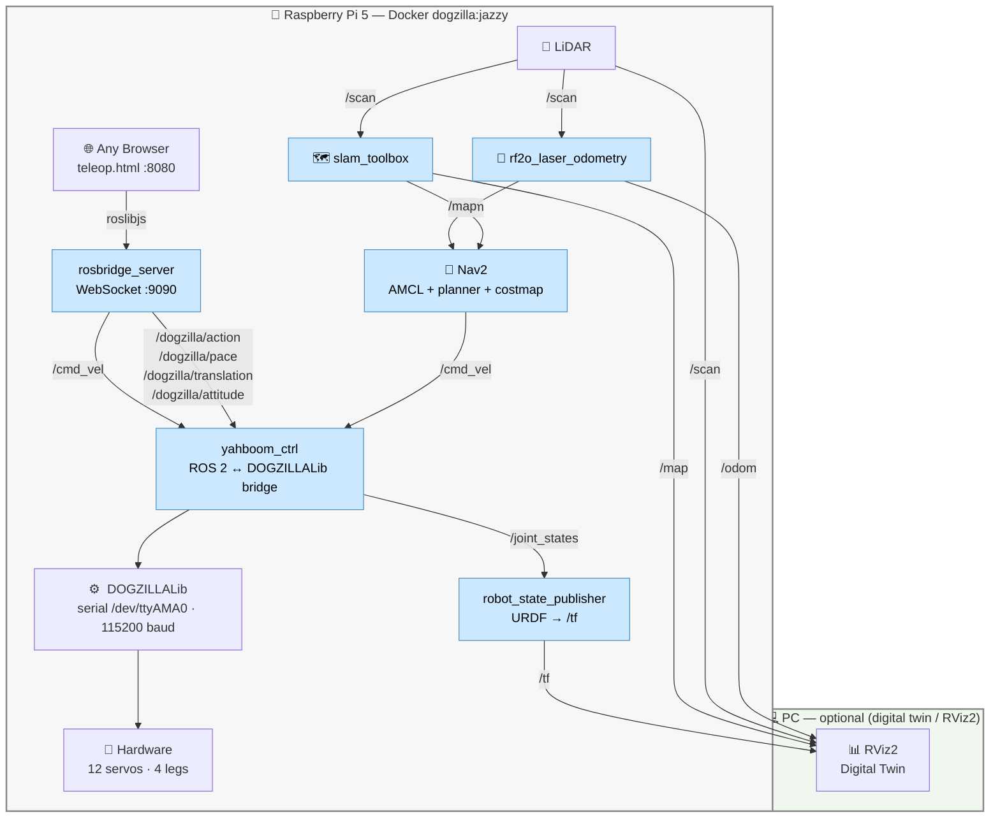

<div align="center">

# 🐕 DOGZILLA

**Autonomous 12-DOF Quadruped Robot — ROS 2 · Raspberry Pi 5 · Docker**

<p>
  
  
  
  
</p>

*Browser-based teleop · SLAM mapping · Autonomous navigation · Digital twin in RViz2*

</div>

---

## Architecture



Everything runs on the Pi — the browser is the only client needed.  
`roslibjs` talks directly to `rosbridge` over WebSocket. Nav2 runs in the same Docker container.  
The PC is optional, only needed for RViz2 visualization.

---

## Teleop Interface

A dark-themed single-page app served at `http://<pi-ip>:8080/teleop.html`:

| Zone | Controls |
|---|---|
| **D-pad** | `Z`/↑ fwd · `S`/↓ back · `Q`/← left · `D`/→ right · `A` turn-L · `E` turn-R · `Space` stop |
| **Pace** | `F1` slow · `F2` normal · `F3` high (or click buttons) |
| **Actions** | `1`–`9` keys or click — 19 motions (Stand Up, Crawl, Wave, Handshake …) |
| **Reset** | `0` — restores initial posture |
| **Camera** | live feed via `/image_raw/compressed` (rosbridge) |
| **Sliders** | Translation X/Y/Z (mm) · Attitude Roll/Pitch/Yaw (°) |

The interface adapts to PC (3-column layout), smartphone, and Samsung Watch.

---

## Workspaces

The repository contains two independent ROS 2 workspaces:

| Workspace | Where it builds | Purpose |
|---|---|---|
| `yahboomcar_ws/` | Pi (inside Docker via `--build`) | Full robot stack — hardware control, SLAM, Nav2, perception |
| `pc_ws/` | PC (native) | Minimal PC-side packages for RViz2 digital twin |

`pc_ws/src/` contains symlinks into `yahboomcar_ws/src/` — sources are never duplicated.

### Building on the Pi

```bash
# First time, or after modifying any ROS 2 package
./docker/run_jazzy.sh --build
```

`colcon build` runs natively on the Pi (ARM64) inside the container. Results are persisted to `yahboomcar_ws/build/`, `install/`, and `log/` via volume mount, so the Pi keeps its built workspace across container restarts.

### Building on the PC

```bash
cd ~/dogzilla/pc_ws
source /opt/ros/jazzy/setup.bash
colcon build --symlink-install
```

Only two packages are compiled: `yahboom_description` (URDF + mesh files, needed for the RobotModel display in RViz2) and `yahboom_msgs` (custom message type definitions, needed to echo or inspect any custom topic from the Pi).

Source in every new terminal before using RViz2 or any ROS 2 tool:

```bash
source /opt/ros/jazzy/setup.bash
source ~/dogzilla/pc_ws/install/setup.bash
export ROS_DOMAIN_ID=0
export FASTRTPS_DEFAULT_PROFILES_FILE=~/dogzilla/fastdds_unicast.xml
```

---

## Quick Start

### 1 — First-time setup on the Pi

```bash
git clone <repo> ~/dogzilla

# Build the ROS 2 workspace inside the container (results persist via volume mount)
./docker/run_jazzy.sh --build
```

### 2 — Build & transfer the Docker image

> Build happens on the PC (x86 → ARM64 cross-compilation via QEMU + buildx).
> Run once; re-run only when `Dockerfile.jazzy` or base dependencies change.

```bash
# One-time setup
sudo apt install docker-buildx
docker buildx create --name multiarch --use
docker buildx inspect --bootstrap

# Build ARM64 image (~30 min first time)
cd ~/dogzilla
docker buildx build \
  --platform linux/arm64 \
  -f docker/Dockerfile.jazzy \
  -t dogzilla:jazzy \
  --output type=docker,dest=/tmp/dogzilla_jazzy_arm64.tar \
  .

# Transfer to Pi
scp /tmp/dogzilla_jazzy_arm64.tar pi@<pi-ip>:~
ssh pi@<pi-ip> docker load -i dogzilla_jazzy_arm64.tar
```

### 3 — Launch

**Robot mode (teleop + IMU/EKF, no LiDAR)**
```bash
./docker/run_jazzy.sh --robot
# open http://<pi-ip>:8080/teleop.html in any browser
# odometry = dead-reckoning (cmd_vel integration) fused with IMU via EKF
```

**SLAM — build a map**
```bash
./docker/run_jazzy.sh --slam
# drive the robot while the map builds
# save with: ros2 run nav2_map_server map_saver_cli -f ~/maps/my_map
```

**Navigation — autonomous (Nav2 on Pi)**
```bash
./docker/run_jazzy.sh --nav /root/maps/my_map.yaml
# set a 2D Nav Goal in RViz2 — robot navigates on its own
```

---

## SLAM Mapping

```bash
# Pi
./docker/run_jazzy.sh --slam

# PC — visualise in RViz2 (optional)
rviz2   # add: Map · LaserScan · RobotModel · TF
```

Drive the robot with the teleop browser while the map builds in RViz2.

**Record a bag for offline SLAM tuning:**
```bash
ros2 bag record /scan /odom /tf /tf_static -o slam_session
ros2 bag play slam_session   # replay as many times as needed
```

---

## Autonomous Navigation (Nav2 on Pi)

Nav2 runs entirely inside the Docker container on the Pi — no PC required for autonomous operation.
It loads a pre-built map, localises the robot within it using AMCL, then plans and executes
trajectories autonomously while continuously avoiding obstacles detected by the LiDAR.

Because this robot has no wheel encoders, odometry is estimated by `rf2o_laser_odometry`,
which computes ego-motion by comparing consecutive LiDAR scans (scan matching).
This odometry feeds into Nav2's AMCL localiser and motion planner.

```bash
# Pi — load a saved map and start Nav2
./docker/run_jazzy.sh --nav /root/maps/my_map.yaml
```

```
Browser (teleop override)        RViz2 (PC, optional)
         │                              │
         └──────── rosbridge ───────────┘
                        │
                    Nav2 (Pi)
                        │  /cmd_vel
                   yahboom_ctrl (Pi) → hardware
```

Set a **2D Nav Goal** in RViz2 and the robot walks there on its own.  
The teleop browser remains available for manual override at any time.

Nav2 params: `yahboomcar_ws/src/yahboom_bringup/config/nav2_params.yaml`

---

## PC ↔ Pi Networking

Both machines must share `ROS_DOMAIN_ID=0` on the same LAN.

```bash
export ROS_DOMAIN_ID=0
export FASTRTPS_DEFAULT_PROFILES_FILE=~/dogzilla/fastdds_unicast.xml
```

`fastdds_unicast.xml` disables multicast (required on most Wi-Fi networks).  
Edit `<address>` inside to set the Pi's static IP if needed.

---

## ROS 2 Node Reference

### Pi — always active (`--robot` and `--nav`)

**`yahboom_ctrl`** · package `yahboom_base`  
The central hardware bridge. Subscribes to `/cmd_vel` (geometry_msgs/Twist) and translates
linear/angular velocity into the DOGZILLALib gait commands sent over serial to `/dev/ttyAMA0`.
Also subscribes to the `/dogzilla/*` topics for finer-grained control (pre-defined actions,
body translation, attitude, pace changes) that go beyond what a Twist can express.
Publishes `/battery_voltage` by polling the hardware periodically.  
In `--robot` mode it is launched with `publish_odom:=true`, which activates dead-reckoning
odometry: the node integrates `/cmd_vel` velocities over time to produce `/odom`
(nav_msgs/Odometry) and broadcast the `odom → base_footprint` TF. This dead-reckoning is
the primary motion source for the EKF in robot mode; in `--nav` mode rf2o provides `/odom`
instead and this parameter stays false.

**`robot_state_publisher`** · package `robot_state_publisher`  
Reads the robot URDF (from `yahboom_description`) and the current `/joint_states`, then
continuously broadcasts the full kinematic tree as TF transforms. Every other node that
needs to know where a link is in space (RViz2, Nav2 costmaps, scan matching) relies on
these transforms. Without this node, the robot has no spatial representation in ROS.

**`yahboom_ctrl`** (joint states + IMU) · package `yahboom_base`  
In addition to handling motion commands, `yahboom_ctrl` is the sole owner of the serial
bus and publishes sensor data at 10 Hz:

- **`/joint_states`** — queries the 12 servo angles via `DOGZILLALib.read_motor()` (serial
  read request to address `0x50`, response: 12 bytes encoded 0–255), converts them to
  radians with per-joint sign correction, and publishes them as `sensor_msgs/JointState`.
  `robot_state_publisher` consumes this topic to keep the digital twin in sync with the
  real robot posture.
- **`/imu/data_raw_self`** — queries roll, pitch, yaw from the on-board MPU6050 via
  `read_roll()` / `read_pitch()` / `read_yaw()` (3 separate serial reads, each returning
  a 4-byte IEEE 754 float), converts to a quaternion, and publishes as `sensor_msgs/Imu`.

> **Why merged:** running a separate `yahboomcar_joint_state` node alongside `yahboom_ctrl`
> opened a second `DOGZILLA()` instance on the same UART, causing interleaved serial frames
> that corrupted motion commands (body and legs decoupled during joystick driving).

**`usb_cam_node_exe`** · package `usb_cam`  
Opens `/dev/video0` (with fallback to `/dev/video1`) and publishes the camera stream as
`/image_raw` and `/image_raw/compressed`. The compressed topic is what the teleop browser
subscribes to via rosbridge — JPEG compression keeps bandwidth manageable over Wi-Fi.

**`rosbridge_websocket`** · package `rosbridge_server`  
Exposes the entire ROS 2 graph over a WebSocket on port 9090, using the JSON-based
`roslibjs` protocol. Any browser (or any client that speaks roslibjs) can publish and
subscribe to ROS topics without installing ROS. This is what makes the teleop interface
work from a phone, a watch, or a laptop browser without any local ROS installation.

**`web_server`** · package `dogzilla_teleop`  
A minimal HTTP server on port 8080 that serves the static web assets: `teleop.html`,
`watch.html` (Samsung Watch layout), and the PWA manifest. The HTML+JS files contain
the entire teleop UI — they make no server-side calls once loaded; all robot communication
goes through the rosbridge WebSocket.

---

### Pi — Robot mode only (`--robot`)

**`ekf_node`** · package `robot_localization`  
An Extended Kalman Filter that fuses two sources to produce a smooth, drift-corrected
`/odometry/filtered` estimate (and the `odom → base_footprint` TF):
- `/odom` — dead-reckoning velocities (vx, vy, vyaw) from `yahboom_ctrl`. Accurate
  over short intervals but accumulates drift over time.
- `/imu/data_raw_self` — orientation (roll, pitch, yaw) from the on-board MPU6050 IMU,
  read by `yahboom_ctrl`. The IMU provides absolute heading, which prevents
  the rotational drift that would otherwise corrupt the dead-reckoning estimate.

The EKF fuses orientation from the IMU and velocities from odometry; it ignores angular
velocity and linear acceleration (not published by this IMU). Configuration:
`yahboom_bringup/config/ekf_robot.yaml`.

---

### Pi — SLAM mode only (`--slam`)

**LiDAR driver** · package `oradar_lidar`  
Opens the OradarMS200 LiDAR on `/dev/ttyAMA1` (serial, not USB) and publishes
`/scan` (sensor_msgs/LaserScan) at ~10 Hz. Also broadcasts the static TF from
`base_link` to `laser_frame` so the scan is properly located in the robot frame.

**`slam_toolbox`** · package `slam_toolbox`  
Online asynchronous SLAM: fuses `/scan` with the odometry embedded in `/tf` to build
and maintain a 2D occupancy grid published as `/map`. The map grows incrementally as
the robot explores. Once the map covers the desired area, it can be saved to disk
with `map_saver_cli` and reloaded later for Nav2 localisation.

---

### Pi — Nav mode only (`--nav`)

All robot mode nodes, plus:

**LiDAR driver** · package `oradar_lidar`  
Same as SLAM mode. In nav mode it feeds both `rf2o_laser_odometry` and the Nav2 costmaps.

**`rf2o_laser_odometry`** · package `rf2o_laser_odometry`  
Estimates the robot's odometry by scan-matching: each new LiDAR scan is compared to the
previous one to derive how much the robot moved. The result is published as `/odom`
(nav_msgs/Odometry). This is the only source of odometry on this robot since it has no
wheel encoders — the legs are too complex to track mechanically. Scan matching works
reasonably well on flat surfaces but drifts over time, which is why AMCL is used on top.

**Nav2 stack** · package `nav2_bringup`  
A suite of nodes that together provide fully autonomous point-to-point navigation:
- **map_server** — loads the saved YAML/PGM map and publishes it as `/map`
- **AMCL** (Adaptive Monte Carlo Localisation) — uses the LiDAR scan and the known map
  to estimate the robot's position with a particle filter, correcting the drift from odometry
- **global planner** — computes a collision-free path from the current pose to the goal
  using the static map (A* or similar)
- **local planner / controller** — tracks the global path in real time, reacting to
  dynamic obstacles detected in the local costmap; publishes the `/cmd_vel` that drives the robot
- **costmaps** (global + local) — maintain inflation layers around obstacles so the
  planners keep a safe margin from walls and objects

---

### PC — optional

**`rviz2`**  
The primary tool for monitoring the robot remotely. With the `pc_ws` sourced, RViz2 can
render the full robot model (RobotModel display), visualise the LiDAR point cloud
(LaserScan), show the SLAM or Nav2 map (Map), display the TF tree, and — in nav mode —
show the planned trajectory and costmaps. It also provides the **2D Nav Goal** tool to
send navigation targets to Nav2 by clicking on the map.

---

### Perception nodes (optional, launch manually on Pi)

**`yahboom_color_tracking`** · package `yahboom_color_tracking`  
Processes the camera stream to detect a specific colour blob. When a blob is found,
it computes angular and distance error and publishes corrective `/cmd_vel` commands so
the robot autonomously tracks and follows the coloured object.

**`yahboom_qrcode_tracking`** · package `yahboom_qrcode_tracking`  
Detects QR codes in the camera feed using OpenCV. Once a code is centred in the frame,
it decodes its content and follows it, useful for marker-based guidance or identification.

**`yahboom_mediapipe`** · package `yahboom_mediapipe`  
Runs Google MediaPipe on the camera stream to extract hand landmarks, body pose, or
facial keypoints. Publishes results as `/mediapipe/points` for downstream gesture
recognition or human-following behaviours.

**`yahboom_publish`** · package `yahboom_publish`  
A C++ image processing pipeline that subscribes to `/image_raw`, applies colour space
conversions (LAB), contour detection, and object segmentation, then republishes results
as `/image_raw/compressed`, `/image_contours`, and `/obj_msg`. Used as a preprocessing
stage for the colour tracking and identification nodes.

**Laser tracker / avoider** · package `yahboom_laser`  
Uses the LiDAR `/scan` for two behaviours: obstacle avoidance (steers away from objects
closer than a configured threshold) and object following (locks onto a nearby obstacle
and follows it at a fixed distance). Also drives a buzzer output when objects are too close.

---

## ROS 2 Topics Reference

| Topic | Type | Flow |
|---|---|---|
| `/cmd_vel` | `geometry_msgs/Twist` | Teleop · Nav2 → `yahboom_ctrl` |
| `/dogzilla/action` | `std_msgs/Int32` | Browser → `yahboom_ctrl` · 1–19 · 255=reset |
| `/dogzilla/pace` | `std_msgs/String` | Browser → `yahboom_ctrl` · `slow`/`normal`/`high` |
| `/dogzilla/translation` | `geometry_msgs/Vector3` | Browser → `yahboom_ctrl` · x±35 y±18 z75-115 mm |
| `/dogzilla/attitude` | `geometry_msgs/Vector3` | Browser → `yahboom_ctrl` · roll±20° pitch±15° yaw±11° |
| `/battery_voltage` | `std_msgs/Float32` | `yahboom_ctrl` → browser header |
| `/image_raw` | `sensor_msgs/Image` | `usb_cam` → perception pipeline |
| `/image_raw/compressed` | `sensor_msgs/CompressedImage` | `usb_cam` → teleop browser (via rosbridge) |
| `/joint_states` | `sensor_msgs/JointState` | `yahboom_ctrl` (via DOGZILLALib serial) → `robot_state_publisher` |
| `/imu/data_raw_self` | `sensor_msgs/Imu` | `yahboom_ctrl` (via DOGZILLALib serial) → `ekf_node` · Nav2 |
| `/scan` | `sensor_msgs/LaserScan` | LiDAR driver → `slam_toolbox` · `rf2o` · Nav2 costmaps |
| `/odom` | `nav_msgs/Odometry` | `yahboom_ctrl` (robot mode) · `rf2o` (nav/slam) → `ekf_node` · Nav2 |
| `/odometry/filtered` | `nav_msgs/Odometry` | `ekf_node` → RViz2 (robot mode only) |
| `/map` | `nav_msgs/OccupancyGrid` | `slam_toolbox` / Nav2 map_server → RViz2 · Nav2 planners |
| `/tf`, `/tf_static` | — | `robot_state_publisher` → RViz2 · Nav2 · scan matching |

---

## Repository Layout

```
dogzilla/
├── DOGZILLALib/              hardware library — serial framing to /dev/ttyAMA0
├── app_dogzilla/             legacy Flask app (port 6500, no ROS)
├── docker/
│   ├── Dockerfile.jazzy      ROS Jazzy + slam-toolbox + nav2 + robot-localization (ARM64)
│   ├── entrypoint_robot.sh   --robot: teleop + dead-reckoning odom + IMU/EKF
│   ├── entrypoint_slam.sh    --slam: robot stack + LiDAR driver + slam_toolbox
│   ├── entrypoint_nav.sh     --nav: robot stack + LiDAR + rf2o odometry + optional Nav2
│   ├── entrypoint_build.sh   --build: colcon build, persists via volume mount
│   └── run_jazzy.sh          container launcher — modes: --robot / --slam / --nav / --build
├── pc_ws/                    PC-only workspace (symlinks into yahboomcar_ws/src/)
│   └── src/
│       ├── yahboom_description -> ../../yahboomcar_ws/src/yahboom_description
│       └── yahboom_msgs        -> ../../yahboomcar_ws/src/yahboom_msgs
├── samples/                  Jupyter notebooks (control, vision, LLM)
├── yahboomcar_ws/src/
│   ├── dogzilla_teleop/      web teleop UI served from Pi (:8080)
│   ├── yahboom_base/         hardware bridge — yahboom_ctrl node
│   ├── yahboom_bringup/      SLAM + Nav2 launch files + nav2_params.yaml + ekf_robot.yaml
│   ├── yahboom_description/  URDF model + STL meshes
│   ├── yahboom_msgs/         custom message definitions
│   └── …                     20+ additional ROS 2 packages
└── fastdds_unicast.xml       DDS peer discovery (disables multicast for Wi-Fi)
```

---

<div align="center">
<sub>Built with ROS 2 Jazzy · Yahboom Dogzilla S2 · Raspberry Pi 5</sub>
</div>
